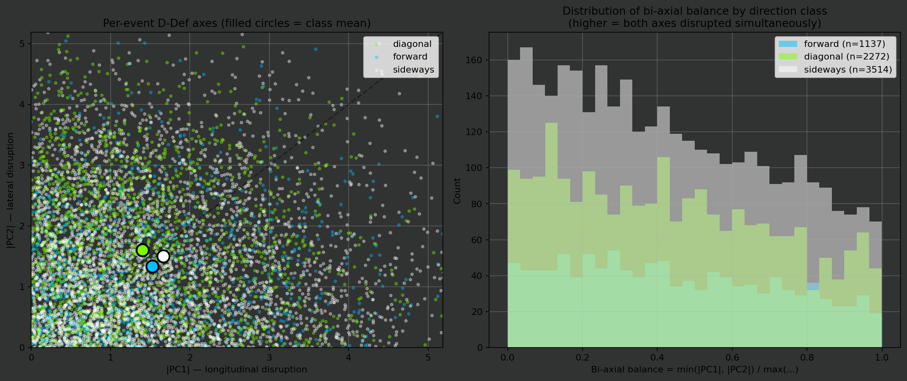

# D-Def empirical validation — Stage 3 / H2

Goes et al. (2019) D-Def with Forcher (2024) local extension. Decomposed via PCA across the full dataset:
  - **PC1** = longitudinal disruption (vertical stretch).
  - **PC2** = lateral disruption (horizontal stretch).
  - **PC3** = shape disruption (deformation).

- Events with valid PCA: 6,909
- Window: 3s

## H2 — Diagonal actions disrupt BOTH axes simultaneously

Spielverlagerung's claim quantified: bi-axial balance ratio = `min(|PC1|, |PC2|) / max(|PC1|, |PC2|)`. **1.0 = perfectly bi-axial; 0.0 = uni-axial.**

```
                    n  abs_pc1  abs_pc2  abs_pc3    ddef  per_class_balance  per_event_balance_mean  local_delta_area  local_delta_spread
direction_class                                                                                                                          
forward          1137   1.5250   1.3341   1.7514  4.6105             0.8748                  0.4441          -15.7600             -0.2151
diagonal         2272   1.4026   1.6063   1.4322  4.4411             0.8732                  0.4345           -0.5241              0.1138
sideways         3514   1.6622   1.4999   1.1577  4.3198             0.9023                  0.4340           11.4142              0.3596
```



### Mann-Whitney U: diagonal vs orthogonal balance

| Test | n_diag | n_other | median_diag | median_other | rbc | p |
|---|---:|---:|---:|---:|---:|---:|
| diagonal vs forward | 2267 | 1134 | 0.4144 | 0.4155 | -0.021 | 0.8445 |
| diagonal vs sideways | 2267 | 3508 | 0.4144 | 0.4035 | +0.002 | 0.4506 |
| diagonal vs ortho (fwd+side) | 2267 | 4642 | 0.4144 | 0.4068 | -0.004 | 0.5997 |
| diagonal vs forward [PC1+PC2] | 2267 | 1134 | 2.9062 | 2.6166 | +0.074 | 0.0002 |
| diagonal vs forward [PC1] | 2267 | 1134 | 1.1583 | 1.2507 | -0.050 | 0.9918 |
| diagonal vs forward [PC2] | 2267 | 1134 | 1.4626 | 1.1329 | +0.142 | 7.01e-12 |
| diagonal vs sideways [PC1] | 2267 | 3508 | 1.1583 | 1.3665 | -0.111 | 1.0000 |
| diagonal vs sideways [PC2] | 2267 | 3508 | 1.4626 | 1.2571 | +0.068 | 6.44e-06 |

## DOS ↔ D-Def — does our DOS predict actual disruption?

Spearman ρ between DOS (input mechanism: defender visual blind-spot exploitation) and D-Def quantities (output: real structural disruption observed in the next 3s).

| Target | N | Spearman ρ | p |
|---|---:|---:|---:|
| pc1_3s | 6909 | -0.1434 | 4.79e-33 |
| pc2_3s | 6909 | -0.2089 | 5.54e-69 |
| pc3_3s | 6909 | -0.0791 | 4.65e-11 |
| ddef_3s | 6909 | -0.3023 | 6.15e-146 |
| local_delta_area | 6909 | -0.1878 | 6.70e-56 |
| local_delta_spread | 6909 | -0.2128 | 1.45e-71 |
| biaxial | 6909 | -0.0001 | 0.9907 |

## Logistic — does DOS predict bi-axial high-balance?

- N = 4761, threshold = 0.4047 (median balance)
- Pseudo R² = 0.0006, LLR p = 0.5871

| coef | value | p |
|---|---:|---:|
| const | +0.1651 | 0.3958 |
| dos | -2.1294 | 0.3942 |
| distance | +0.0006 | 0.8467 |
| pressure_player | -0.0808 | 0.4487 |
| n_def_lane | +0.0293 | 0.3041 |
| n_def_goal | -0.0176 | 0.3174 |

## Per event-type

```
               n  abs_pc1  abs_pc2    ddef  biaxial_mean
event_type                                              
carry       1604   1.7086   1.7057  4.8488        0.4417
pass        5128   1.5039   1.4596  4.2771        0.4340
takeon       191   1.6235   1.1041  4.1774        0.4368
```