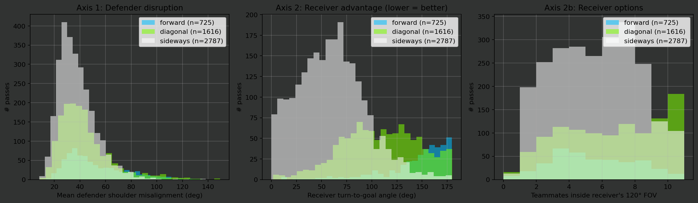

# Theta orientation metrics — storytelling cifras

Per-direction-class numbers from `src/theta.py` (defender disruption + receiver advantage). Designed for direct citation in the narrative document.

- Events with theta computed: 6,732/6,923

## Passes — per-direction summary

Angles in degrees. `pct_nearest_blind` ∈ [0, 1]. `receiver_turn_deg` is the angle the receiver still needs to rotate to face goal — lower = more pre-oriented. `n_teammates_in_fov` counts teammates inside the receiver's 120° binocular cone at reception.

```
                    n  mean_theta_shoulder_deg  mean_theta_head_deg  pct_nearest_blind  mean_n_wrongfooted  mean_pct_wrongfooted  mean_theta_affected_deg  receiver_open_deg  receiver_turn_deg  n_teammates_in_fov
direction_class                                                                                                                                                                                                    
forward           725                    51.68                54.06               0.41                2.75                  0.93                   121.33             135.03             144.51                4.95
diagonal         1616                    43.87                42.12               0.34                2.07                  0.91                   115.66             102.12             108.45                6.03
sideways         2787                    37.74                31.23               0.29                1.14                  0.94                   115.17              57.90              59.94                5.12
```



### Passes — Mann-Whitney U: diagonal vs forward

`alt='greater'` = diagonal has higher; `alt='less'` = diagonal has lower. `rbc` = rank-biserial correlation (effect size; +1 = perfect, 0 = none, signed in the direction of the alternative).

| Metric | alt | n diag | n fwd | median diag | median fwd | rbc | p |
|---|---|---:|---:|---:|---:|---:|---:|
| Defender shoulder misalignment | greater | 1616 | 725 | 39.34 | 44.89 | -0.211 | 1.0000 |
| Defender head misalignment | greater | 1616 | 725 | 35.69 | 44.87 | -0.213 | 1.0000 |
| Nearest defender in blind half | greater | 1616 | 725 | 0.00 | 0.00 | -0.069 | 0.9993 |
| Wrongfooted defenders | greater | 1616 | 725 | 2.00 | 2.00 | -0.240 | 1.0000 |
| % wrongfooted of affected | greater | 1447 | 682 | 1.00 | 1.00 | +0.000 | 0.4952 |
| Receiver body→goal angle | less | 1114 | 384 | 100.75 | 145.79 | -0.438 | 7.52e-38 |
| Receiver head→goal angle | less | 1114 | 384 | 109.63 | 154.84 | -0.555 | 1.62e-59 |
| Teammates in receiver FOV | greater | 1114 | 384 | 6.00 | 5.00 | +0.218 | 6.68e-11 |

## Carries — per-direction summary (defender side only)

Carries don't have a 'receiver' — only axis 1 metrics apply.

```
                   n  mean_theta_shoulder_deg  mean_theta_head_deg  pct_nearest_blind  mean_n_wrongfooted  mean_pct_wrongfooted  mean_theta_affected_deg
direction_class                                                                                                                                         
forward          373                    39.43                22.22               0.05                0.64                  0.50                    69.19
diagonal         587                    37.65                21.68               0.03                0.66                  0.56                    74.41
sideways         644                    30.71                16.59               0.05                0.89                  0.53                    73.05
```

### Carries — Mann-Whitney U: diagonal vs forward

| Metric | alt | n diag | n fwd | median diag | median fwd | rbc | p |
|---|---|---:|---:|---:|---:|---:|---:|
| Defender shoulder misalignment | greater | 587 | 373 | 36.24 | 37.43 | -0.062 | 0.9486 |
| Defender head misalignment | greater | 587 | 373 | 19.99 | 19.59 | +0.004 | 0.4601 |
| Nearest defender in blind half | greater | 587 | 373 | 0.00 | 0.00 | -0.017 | 0.9127 |
| Wrongfooted defenders | greater | 587 | 373 | 0.00 | 0.00 | +0.011 | 0.3711 |
| % wrongfooted of affected | greater | 352 | 227 | 0.67 | 0.50 | +0.075 | 0.0545 |
