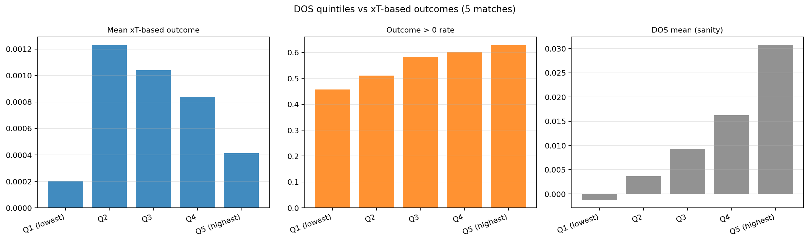

# DOS empirical validation — xT-DELTA outcome

Outcome metric replaced: **`parent_possession_xg`** → **`xt_delta`** (Karun Singh 2018 12×8 grid). Take-ons use `xt_origin` (no displacement, value preserved).

- Events: carry=1604, pass=5128, takeon=191
- Total rows with valid outcome: 6,923

## Mann-Whitney U: DOS higher when outcome > 0?

One-sided alternative: events with positive xT-based outcome have **higher DOS** than those with non-positive.

| Subset | n+ | n− | mean DOS (+) | mean DOS (−) | rbc | U | p |
|---|---:|---:|---:|---:|---:|---:|---:|
| ALL events | 3757 | 3166 | 0.0129 | 0.0104 | +0.145 | 6809438 | 1.16e-25 |
| passes only | 2517 | 2611 | 0.0123 | 0.0108 | +0.076 | 3535825 | 1.21e-06 |
| carries only | 1145 | 459 | 0.0142 | 0.0082 | +0.402 | 368320 | 1.22e-36 |
| takeons only | 95 | 96 | 0.0107 | 0.0100 | +0.068 | 4868 | 0.2104 |

## Continuous correlation DOS ↔ outcome

| Subset | n | Spearman ρ | p (spearman) | Pearson r | p (pearson) |
|---|---:|---:|---:|---:|---:|
| ALL events | 6923 | +0.1009 | 3.92e-17 | -0.0064 | 0.5961 |
| passes only | 5128 | +0.0443 | 0.0015 | -0.0094 | 0.4996 |
| carries only | 1604 | +0.3180 | 5.05e-39 | +0.0615 | 0.0137 |
| takeons only | 191 | -0.0415 | 0.5691 | -0.1089 | 0.1337 |

## Logistic regression: P(outcome > 0) ~ dos + controls

Controls: distance, pressure_player, n_def_lane, n_def_goal.
If DOS coef stays significant after adjustment → DOS captures something beyond geometry/pressure/defender count.

### Subset: `ALL events`

- N=4761, Pseudo R²=0.0388, LLR p=3.21e-53

| coef | value | p |
|---|---:|---:|
| const | -0.2836 | 0.1586 |
| dos | +10.8599 | 2.58e-05 |
| distance | -0.0070 | 0.0345 |
| pressure_player | -1.3741 | 5.52e-34 |
| n_def_lane | +0.0145 | 0.6199 |
| n_def_goal | +0.0759 | 3.39e-05 |

### Subset: `passes only`

- N=4761, Pseudo R²=0.0388, LLR p=3.21e-53

| coef | value | p |
|---|---:|---:|
| const | -0.2836 | 0.1586 |
| dos | +10.8599 | 2.58e-05 |
| distance | -0.0070 | 0.0345 |
| pressure_player | -1.3741 | 5.52e-34 |
| n_def_lane | +0.0145 | 0.6199 |
| n_def_goal | +0.0759 | 3.39e-05 |

### Subset: `carries only`

_Fit skipped (n=0)._

## DOS quintiles (xT outcome)

```
                 n  dos_mean  outcome_mean  outcome_pos_rate  outcome_p95
dos_q                                                                    
Q1 (lowest)   1385 -0.001281      0.000199          0.457040     0.012990
Q2            1384  0.003657      0.001230          0.510838     0.016335
Q3            1385  0.009332      0.001041          0.583394     0.014560
Q4            1384  0.016200      0.000837          0.602601     0.013478
Q5 (highest)  1385  0.030802      0.000412          0.628881     0.015534
```



## Direction class breakdown (xT outcome)

```
                    n  dos_mean  outcome_mean  outcome_pos_rate  awareness_mean
direction_class                                                                
forward          1137  0.012070      0.002828          0.743184        0.404185
diagonal         2272  0.012064      0.002674          0.822183        0.416295
sideways         3514  0.011429     -0.001179          0.324417        0.463310
```

## Per event-type breakdown

```
               n  dos_mean  xt_origin_mean  outcome_mean  outcome_pos_rate  diag_share
event_type                                                                            
carry       1604  0.012493        0.017542      0.002973          0.713840    0.365960
pass        5128  0.011559        0.017444     -0.001056          0.490835    0.315133
takeon       191  0.010361        0.030330      0.030330          1.000000    0.361257
```