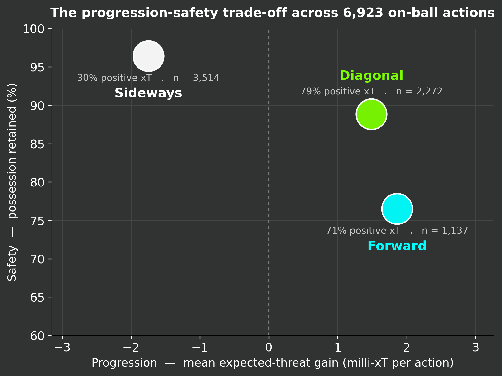
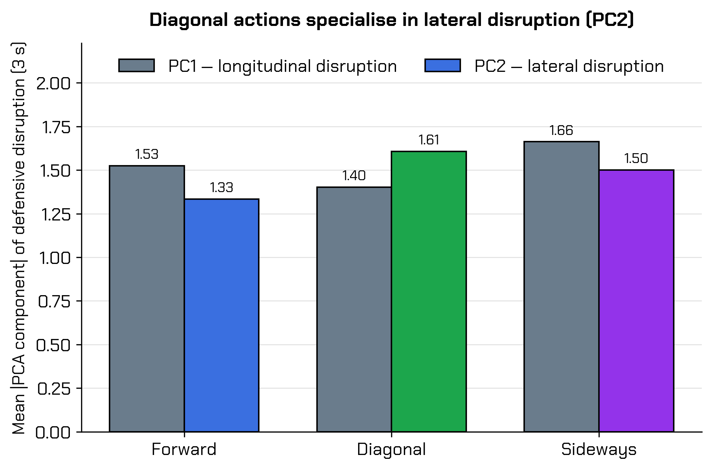
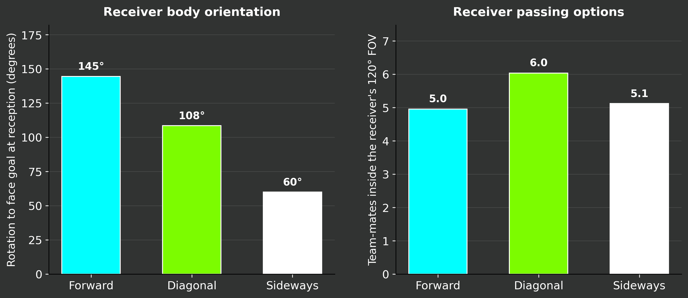
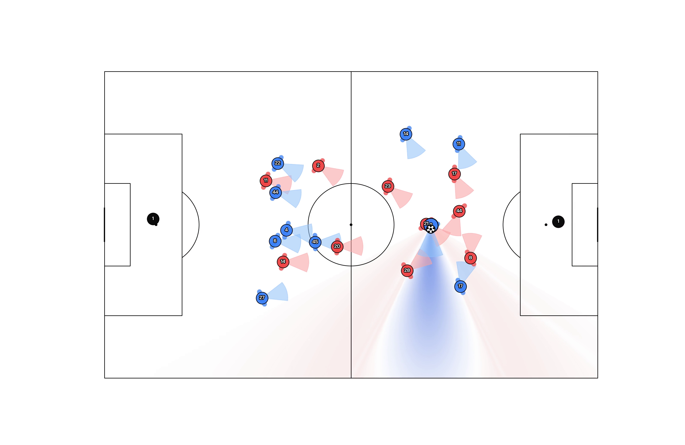
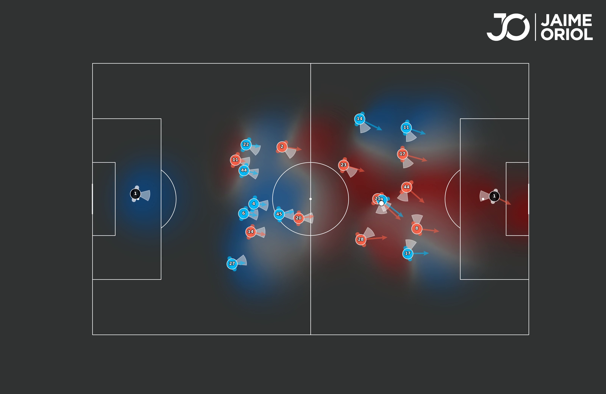
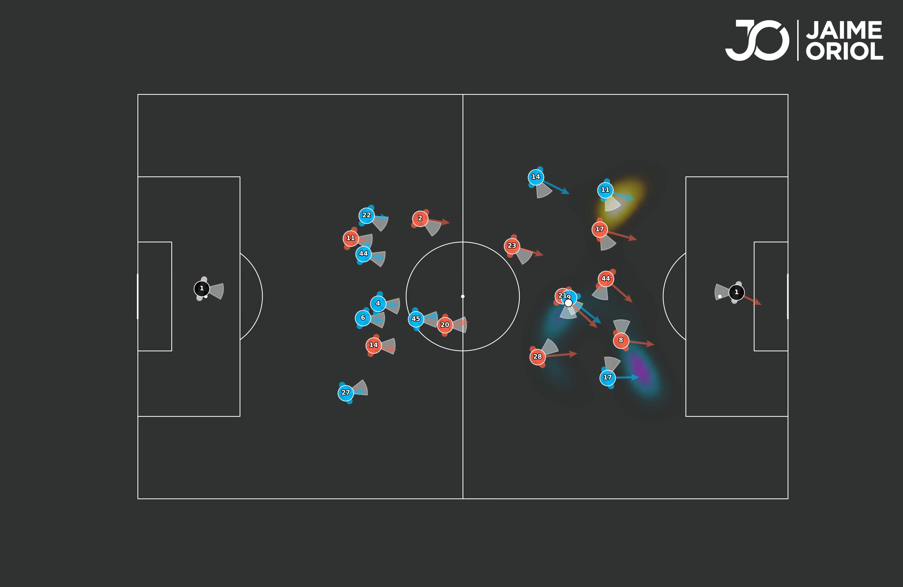
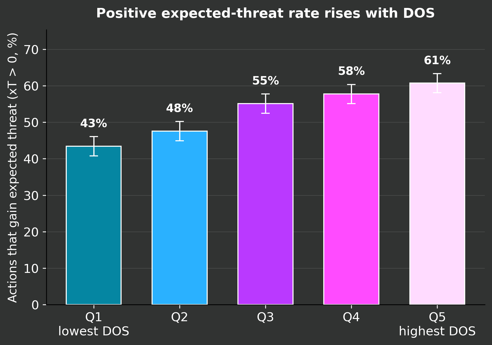
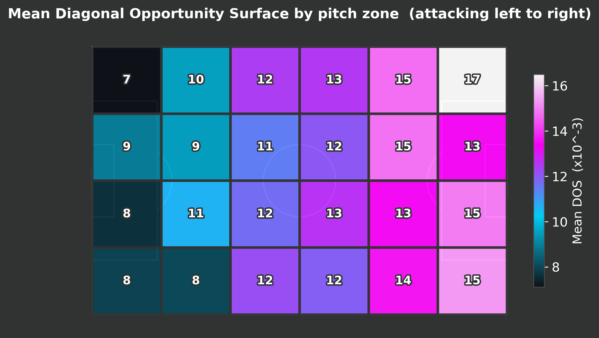
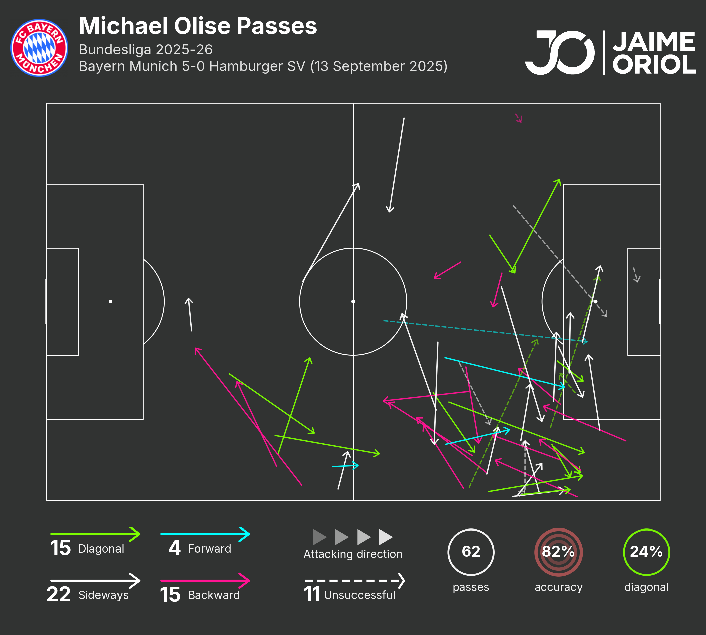

# Diagonality: The Best of Both Worlds

**Validating a Tactical Theory and Building a Real-Time, Orientation-Aware Map of Diagonal Opportunity from 3D Skeleton Tracking**

Jaime Oriol
AWS World Sports Innovation Cup 2026 — Challenge 2: Unlock the Power of 3D Football Data

> This is the Markdown rendering of the deliverable. The authoritative
> source is `main.tex`; the compiled PDF is `docs/Challenge_3D_Football_Data.pdf`.

---

## Abstract

Diagonality — the preference for oblique passes, carries and runs over straight vertical or horizontal ones — is among the most discussed yet least quantified ideas in modern football. Spielverlagerung's 2025 essay frames it as *"the best of both worlds"*: a diagonal action is *claimed* to combine the progression of a vertical pass with the safety of a horizontal one. The essay itself hedges — it speaks of the "(assumed)" progression and the "(assumed)" safety — because the concept is fundamentally about *body orientation*, and tracking data captured positions, never orientation. We use TRACAB 3D skeleton tracking from five Bundesliga 2025–26 matches (21 keypoints per player at 50 Hz, the first dataset with directly measured head, shoulder and hip orientation) to do two things. First, we **test the article**: we restate its claims as a perceptual premise and three falsifiable hypotheses, and test the hypotheses against 6,923 on-ball actions with metrics that owe nothing to our own model. The claims hold — diagonal actions are Pareto-efficient on the progression–safety plane, they disrupt the defensive block on its lateral axis, and they hand the receiver a body already turned toward goal. Second, and our core contribution, we turn the validated theory into a tool: the **Diagonal Opportunity Surface** (DOS), a real-time, action-independent pitch map that fuses what the on-ball player can see, how the defenders are oriented, and who controls space into a single signal of danger — a defender's blind spot, the orientation delay in reaching it, and the directional benefit of arriving oblique. DOS is built from a per-defender vision model adapted from Bekkers, an orientation-aware pitch-control function, and a cognitive scanning gate; it scores passes, carries, take-ons and the 2,354 detected off-ball runs with one routine, and it predicts expected-threat gain after controlling for distance, pressure and defender counts (Mann–Whitney *p* < 10⁻²⁵). We release DOS as a coach-facing, per-opponent map of where, when and against whom to attack diagonally.

---

## 1. Introduction

For two decades, coaching discourse has been governed by a single imperative: *play forward*. Progress the ball toward goal whenever the chance appears, and mitigate the risk of losing it with counter-pressing. Its mirror image, no less dominant, is *keep the ball*: recycle horizontally, accept that an action gains no ground, and trade progression for near-certain retention. It is tempting to read these as rival philosophies. They are not. They are the two ends of a single axis — **progression versus safety** — and every pass a team plays is, implicitly, a choice of where to sit on it. A vertical pass maximises progression and, with it, risk: it travels into traffic, toward defenders who are already facing it. A horizontal pass maximises safety and, with it, sterility: it concedes no ground and asks the defence no question.

Spielverlagerung's 2025 deep-dive on *Diagonality* (Spielverlagerung, 2025) makes a sharp claim: there is an optimum *between* the poles. A diagonal action, the essay argues, captures "the (assumed) progression of a vertical pass and the (assumed) safety of a horizontal pass" — *"progress with less risk, control with the chance to react."* Jamie Hamilton's *Diagonalist Manifesto* (Hamilton, 2024) reframes the same intuition in vectorial terms, with the diagonal reception as the point of maximum tactical multiplicity.

The word the Spielverlagerung authors are careful to keep in brackets — "(assumed)" — is the entire problem. Diagonality has never been measured because it is not, at bottom, a property of *where* the ball goes; it is a property of *how the players are turned* when it gets there. A defender does not react to a pass. A defender reacts to what they *see* of a pass, and seeing is asymmetric: the human visual field has only 2–3° of high-acuity foveal vision, beyond which the periphery delivers a blurred, low-resolution impression that costs measurable time to resolve into a decision (Vater, 2024). A pass that arrives in a defender's fovea is read instantly; a pass that arrives in the periphery, or behind the shoulder, is read late. Whether a delivery is "diagonal" in the sense that matters therefore depends on the angle between the defender's body and the ball — and tracking data never recorded that angle. It had to be proxied from the velocity vector, which a player can violate at will simply by running one way while facing another; the proxy carries 30–50° of error (Arbués-Sangüesa et al., 2020), enough to drown the signal. Bekkers (2026) reduced the error to ~27° with broadcast pose estimation. We remove it: TRACAB optical 3D skeleton tracking records the real head, shoulder and hip keypoints of every player at 50 Hz.

This work proceeds in two movements. First we **test the theory**. The Spielverlagerung essay is a long, qualitative argument; we distil it into a perceptual premise and three falsifiable hypotheses (Section 4) and test them against the data using only classical, model-independent metrics (Section 5). The claims hold. That result licenses the second movement, which is the contribution. If diagonality genuinely works, knowing so is not enough: a coach still needs to know *where* on the pitch, *when* in a possession and against *which* defender a diagonal pays, and a player needs to recognise the opportunity in the half-second they have to take it. We answer that with the **Diagonal Opportunity Surface** (Section 6) — a real-time, action-independent map of where a diagonal delivery breaks a defender who cannot see it.

**Contributions.** **(1)** An empirical test of Spielverlagerung's diagonality theory against 6,923 on-ball actions from 3D skeleton tracking, using outcome metrics independent of our model. **(2)** A four-stage, orientation-aware framework computed entirely on real skeleton orientation: a per-defender vision model, an orientation-aware pitch-control function, the DOS surface, and a cognitive scanning gate. **(3)** DOS itself — a new, action-independent pitch surface that scores passes, carries, take-ons and off-ball runs with one routine and predicts expected-threat gain. **(4)** A coach-facing deliverable: DOS aggregated per pitch zone and per opponent, and a real-time reading of passing, carrying and running opportunities gated by what the on-ball player can actually perceive.

---

## 2. Related Work

This work sits at the intersection of four research lines that have, so far, run in parallel.

**Pitch control.** The spatial analysis of football began with the dominant-region model of Taki & Hasegawa (2000), which partitioned the pitch by who could reach each point first. Spearman et al. (2017) replaced the geometric partition with a physics-based, probabilistic pass model, and Spearman (2018) extended it to off-ball scoring opportunity. Fernández & Bornn (2018) introduced a complementary influence-field formulation of space, later generalised by the SoccerMap deep architecture (Fernández & Bornn, 2020). Every model in this lineage shares one blind spot: a player is a disc or an isotropic Gaussian, equally fast and equally aware in all directions. None encodes which way the player is facing, and so none can express the central fact of diagonality — that a defender controls the space in front of them far better than the space behind their shoulder.

**Visual perception and scanning.** A separate, older tradition studies what footballers *see*. Laboratory eye-tracking established that skilled players search more efficiently, with shorter fixations across more informative locations (Roca et al., 2011; Vaeyens et al., 2007). Carrying the finding onto the pitch, Jordet et al. (2013) showed that visual exploration before receiving the ball — the habitual "shoulder check" — is a hidden foundation of elite performance, and McGuckian et al. (2018) confirmed that exploration before possession relates directly to on-ball output. The field long measured this by counting *visual exploratory actions* (rapid head turns above 125°/s), a binary, position-biased proxy. Bekkers (2026) replaced the count with a continuous, probabilistic vision model built from pose-enhanced tracking, and showed it predicts on-ball outcomes far better than the traditional count. Our vision stage adapts that model; our scanning gate (Section 6.5) operationalises Jordet's pre-possession exploration as a 2.5 s memory.

**Defensive disruption.** On the defensive side, Goes et al. (2019) introduced D-Def, a tracking-only measure of how much a pass disturbs the opposing block — the change, three seconds later, in its centroid, line centroids, surface area and spread. Forcher et al. (2021) validated it on elite passing sequences, and Forcher et al. (2024) showed that compactness *local* to the ball, rather than whole-team compactness, is what matters for defensive success. We use D-Def, decomposed by its longitudinal and lateral components, as one of our independent tests of the diagonality theory.

**Action value, biomechanics and off-ball runs.** Action-value models attach a number to each on-ball event: expected threat (Singh, 2018), VAEP (Decroos et al., 2019) and expected pass difficulty (Anzer & Bauer, 2022). The biomechanical cost that makes orientation matter is documented independently of football: reaction time rises monotonically with the visual eccentricity of a stimulus (Vater, 2024), and re-orienting to chase an oblique threat carries a measurable change-of-direction time penalty (Dos'Santos et al., 2018). Off-ball runs — the third way to progress — are by now an industry product: SkillCorner's Game Intelligence (SkillCorner, 2024) and Stats Perform's Opta Vision (Stats Perform, 2025) both detect and classify them automatically, and Llana et al. (2022) value them against a possession model.

**The gap.** Each line is mature on its own. None has been crossed. Pitch control does not know what a defender sees; the scanning literature does not connect to space control; D-Def measures the consequence of a pass without modelling its perceptual cause; and the tactical theory of diagonality has never been tested against tracking data at all. Joining a vision model to orientation-aware pitch control, to defensive disruption, and to the concept of diagonality — and turning the result into a real-time tool — is the contribution of this work.

---

## 3. Data

We analyse five Bundesliga 2025–26 matches provided by DFL / Sportec Solutions with TRACAB GEN5/GEN6 3D skeleton tracking (Table 1, ~20.6 GB total). Each frame provides, at 50 Hz, **21 three-dimensional keypoints per player** — ears, nose, shoulders, neck, elbows, wrists, hips, pelvis, knees, ankles, heels and toes — in metres from the pitch centre.

From the keypoints we derive each player's orientation on three *independent* signals, and the independence matters. Head yaw (perpendicular to the ear–ear axis) is where the player is *looking* — the input to the vision model. Shoulder facing (perpendicular to the shoulder axis) is where the player's reach and first step are aimed — the input to pitch control. Hip facing (perpendicular to the hip axis) carries the player's momentum. A defender can have hips square to their own goal, shoulders half-turned, and eyes checking a runner over the far shoulder all at once; only 3D skeleton data separates the three. Player position is the pelvis keypoint. This is the decisive advantage over prior work: orientation is *measured*, not estimated from broadcast video (~27° error) or proxied from velocity (30–50°).

**Table 1.** The five Bundesliga 2025–26 matches. Skeleton at 50 Hz; events synchronised to the skeleton via `SyncedFrameId`.

| Match | Result | Skeleton frames |
|---|:--:|--:|
| Bayern Munich – Hamburger SV | 5–0 | 419 K |
| Borussia Dortmund – VfB Stuttgart | 3–3 | 399 K |
| Eintracht Frankfurt – Bayern | 0–3 | 384 K |
| Eintracht Frankfurt – Union Berlin | 3–4 | 413 K |
| Union Berlin – Bayern | 2–2 | 392 K |

Skeleton data is paired with DFL enriched event data (`kpi_data`): roughly 1,190 passes and 338 carries per match, each carrying a `PlayAngle`, an expected pass probability, pressure, defender counts and a `SyncedFrameId` that aligns the event to the skeleton frame. Successful take-ons are recovered from the `TacklingGame` events. After synchronisation and filtering we evaluate **6,923 on-ball actions** — 5,128 passes, 1,604 carries and 191 take-ons — and, from the continuous skeleton, detect **2,354 off-ball runs** (Section 6.6). Throughout, we use the DFL directional classes, defined by the angle of the action relative to the attacking axis: *forward* (|angle| ≤ 22.5°), *diagonal* (22.5°–67.5°), *sideways* (67.5°–112.5°) and *backward* (> 112.5°). The analysis contrasts the first three.

---

## 4. The Claims of Diagonality

The Spielverlagerung essay is an argument, not a dataset. Before we can test it we must state precisely what it asserts. We read the article and distil its reasoning into four claims: a perceptual premise (H1) the framework is built on, and three falsifiable hypotheses (H2–H4) tested in Section 5. Each is introduced by the mechanism the article proposes.

### 4.1 H1 — The perceptual premise: a defender reacts late to what he cannot see

The essay's central mechanism is perceptual. "A diagonal pass," it writes, "asks more questions. Your body has to turn and your eyes don't focus into your peripheral vision, but they have to intake a lot of information in your previous blind spots" — so that "your decision might have to come prior to your information" (Spielverlagerung, 2025). A horizontal pass stays in front of the defender; eyes and body track it together. A vertical pass travels straight at the defender and naturally engages them. A diagonal pass does neither. It crosses the defender's line of sight at an angle, forcing a choice between turning to follow it and holding to cover the space behind — a choice that, because the information arrives in the slow periphery, must often be made before it is fully resolved.

This is consistent with how vision and reaction actually work. Only 2–3° of the visual field is high-acuity; everything else is monitored peripherally, and reaction time to a peripheral stimulus rises with its eccentricity (Vater, 2024). Skilled players compensate by scanning — the habitual shoulder-check that Jordet et al. (2013) and McGuckian et al. (2018) tie to performance — but scanning is itself evidence that what is not currently foveated is, for that moment, unknown. **Role.** H1 is the perceptual *premise* of this work, not a class-average contrast to be tested like the others. Where H2–H4 each predict a measurable difference between direction classes, H1 asserts the mechanism itself — that a defender acts on what he sees, and resolves late what falls in his periphery or behind his shoulder. We therefore do not test it with a summary statistic; we *operationalise* it. The vision model (Section 6.1) and the detection-delay term (Section 6.3) are H1 made computable, and the premise stands or falls with the surface built on it: were it wrong, DOS could not predict value — and Section 6.5 shows it does.

### 4.2 H2 — Bi-axial disruption: the diagonal breaks two lines at once

A defensive block is organised on two axes: horizontal lines that hold depth and vertical relationships that hold width. An orthogonal action tests one of them. A vertical pass drives at the depth of a line; a horizontal pass slides along it. The essay's claim is that a diagonal tests both: "a diagonal breaks both the horizontal and the vertical line at once", and "a diagonal movement usually disturbs the opposition horizontally and vertically" (Spielverlagerung, 2025). Because a diagonal carries, in the article's words, "two tactical instructions — advance and shift" — the defence cannot answer it by sliding or by dropping alone; it must do both, and doing both forces either a role exchange between defenders or a collective retreat. **Prediction:** when defensive disruption is decomposed into a longitudinal and a lateral component, diagonal actions register on both, and carry the highest *combined* disruption — where forward actions concentrate on the longitudinal axis and sideways actions on neither.

### 4.3 H3 — The receiver: a body already turned to play

Diagonality helps the team in possession as much as it hurts the defence, and again the mechanism is perception and geometry. "The receiver of a diagonal pass," the essay writes, "usually has a simpler task at hand … the ball is in your field of vision as is your preferred direction of the follow-up action. Your body position will usually already be in a position to progress" (Spielverlagerung, 2025). A vertical pass into feet arrives behind the receiver, who must turn 180° before they can use it; a horizontal pass commits the receiver to a single direction. A diagonal pass arrives across the receiver's open side: the ball and the goal sit in one field of view, the hips are already half-turned, and — crucially in the half-space, "the ideal intersection of *I have enough space* and *what I can't see doesn't matter*" — both the continuation of the move and its interruption stay available. Hamilton calls this the point of maximum tactical multiplicity (Hamilton, 2024). **Prediction:** the receiver of a diagonal pass needs less rotation to face goal and has more team-mates inside their field of view at the moment of reception.

### 4.4 H4 — The trade-off: the diagonal is the Pareto optimum

The three mechanisms above combine into the essay's headline claim, the one it deliberately hedges. A diagonal action is said to "mix the (assumed) progression of a vertical pass and the (assumed) safety of a horizontal pass" (Spielverlagerung, 2025). Stated as a measurable proposition: on a plane whose axes are progression (expected-threat gain) and safety (retention of possession), forward actions occupy the progression pole and sideways actions the safety pole, and the diagonal should sit between them as an efficient compromise — not dominated by either, and better than both on the combined outcome of *gaining threat without losing the ball*. **Prediction:** diagonal actions are Pareto-efficient on the progression–safety plane and produce the highest rate of value-positive outcomes.

---

## 5. Does the Data Confirm the Article?

We now test H2–H4; H1, the perceptual premise, is operationalised by the model itself and tested indirectly when the resulting surface predicts value (Section 6.5). Every metric in this section — the DFL direction class, expected threat (Singh, 2018), defensive disruption (Goes et al., 2019; Forcher et al., 2021), and the orientation angles read directly from the skeleton — is classical and owes nothing to the model introduced in Section 6. The point is deliberate: if the data contradicted Spielverlagerung, there would be nothing to operationalise, and we would not build a tool on a false premise.

### 5.1 The progression–safety trade-off (H4)

Figure 1 places every on-ball action on the progression–safety plane, with the mean expected-threat gain of the class on one axis and the share of the class that retains possession on the other. The geometry is exactly the one the essay describes. Forward actions sit at the progression pole: they generate the most expected-threat gain, and they retain the ball the least — the vertical pass that, in the article's phrase, gets you "killed or crowned". Sideways actions sit at the opposite pole: they retain possession almost without exception, and their mean expected-threat change is *negative* — motion without progress, safe but sterile.

Diagonal actions are neither pole, and that is the point. They retain the ball far more often than forward actions, sacrifice only a little of the expected-threat gain, and — the decisive number — produce a value-positive outcome in 79% of cases, the highest of the three classes and well clear of forward (71%) and sideways (30%). A diagonal is not the safest action and not the most progressive; it is the one that most often does both at once. The brackets the Spielverlagerung authors placed around "(assumed)" can be removed. **H4 holds.**

**Figure 1. The progression–safety trade-off across 6,923 on-ball actions (H4).** Forward sits at the progression pole, sideways at the safety pole; diagonal is the efficient compromise, with the highest rate of value-positive outcomes. Retention counts a completed pass, or possession kept through a carry or take-on.

### 5.2 Bi-axial disruption — the defender (H2)

Why can the diagonal cheat a trade-off? The defensive side of the answer is in Figure 2, which decomposes D-Def — measured three seconds after the action — into its longitudinal component (PC1, the stretching and breaking of depth) and its lateral component (PC2, the stretching of width).

The honest reading is more interesting than a clean sweep. Diagonal actions do not dominate every axis: forward actions, which drive straight into the block, disturb the longitudinal axis just as much. What distinguishes the diagonal is the *lateral* axis. Its PC2 disruption is significantly higher than forward's (*p* = 7.0 × 10⁻¹²) — the diagonal is, specifically, the lateral-disruption specialist — and its *combined* PC1 + PC2 disruption is the highest of the three classes (*p* = 2 × 10⁻⁴). A vertical pass tests the line a defence is built to hold; a diagonal tests that line *and* the one beside it, exactly the two-axis demand the essay describes. **H2 holds.**

**Figure 2. Defensive disruption (D-Def, Goes/Forcher; H2).** Per-event longitudinal (PC1) and lateral (PC2) disruption, three seconds after the action. Diagonal actions are the lateral-disruption specialists and carry the highest combined PC1 + PC2 disruption.

### 5.3 The receiver's advantage (H3)

The attacking side of the answer is perceptual (Figure 3). We read, from the skeleton, two things about the receiver at the instant the ball arrives: how far they still have to rotate their head to face goal, and how many team-mates fall inside their 120° binocular cone.

Both confirm the essay. The receiver of a diagonal pass needs a mean rotation of 108° to face goal, against 145° for a forward pass — a difference of nearly forty degrees, statistically overwhelming (*p* = 1.6 × 10⁻⁵⁹) and large in effect. And the diagonal receiver sees more: 6.0 team-mates inside the binocular cone against 5.0 for a forward pass (*p* = 6.7 × 10⁻¹¹). The diagonal receiver, in Spielverlagerung's words, arrives "already in a position to progress", and in Hamilton's, at the point of maximum multiplicity — the body open, the goal and the ball in one frame, the next options already visible. **H3 holds.**

**Figure 3. Receiver advantage (H3).** The receiver of a diagonal pass needs far less rotation to face goal (left) and has more team-mates inside the 120° binocular cone at reception (right).

**The article holds.** Across three independent tests — a trade-off geometry, a defensive-disruption decomposition, and a perceptual reading of the receiver — the data confirms Spielverlagerung. Diagonality is not folklore. That settles *whether* the diagonal works. It does not tell a coach *where* on the pitch, against *which* defender, or a player *in the moment*. The rest of this paper builds the tool that does.

---

## 6. The Diagonal Opportunity Surface

The validation shows that diagonal actions work; it does not locate the opportunity. A direction class is a label applied after the fact. What a coach and a player need is the opposite: a map, available at every frame, of where on the pitch a diagonal delivery would pay — and *why*. The Diagonal Opportunity Surface (DOS) is that map.

DOS is built on one idea, taken straight from H1: a defender's control of space is not symmetric, because their *perception* of space is not symmetric. We make this computable in three layers — what a player can *see* (Section 6.1), what a player can physically *reach* given how they are turned (Section 6.2), and how much those two diverge for a defender facing the wrong way (Section 6.3) — and then add a fourth, cognitive layer (Section 6.5) that restricts the map to what the player on the ball can actually perceive, turning a god-eye statistic into a real-time decision aid. DOS is *action-independent*: the same routine scores a pass, a carry, a take-on or an off-ball run, because all four reduce to an origin and a direction.

### 6.1 What the player sees — the vision model

The first layer answers, for every player and every point on the pitch, *can this player see that point*. We adapt the probabilistic vision model of Bekkers (2026) to TRACAB metres. The visible region is a 120° cone around the measured head yaw — the binocular field — with a Gaussian decay in two directions: radially, because distant objects are harder to localise, and angularly, because acuity falls from fovea to periphery. Both decays are modulated by the player's speed: a sprinting player loses peripheral awareness and the cone narrows, a stationary player's cone is wide. On top of the cone we compute occlusion. Every other player on the pitch casts an angular shadow, and the width of that shadow is derived from that player's *real* shoulder width from the skeleton — a player side-on occludes little, a player square-on occludes a torso — where Bekkers (2026) used a single fixed width for everyone. The output is a per-player grid *Vᵢ(x,y)* ∈ [0,1]: the probability that player *i* is visually aware of location *(x,y)*. Figure 4 shows one frame.

**Figure 4. Vision model.** Per-player field of view: a 120° probabilistic cone around the measured head yaw, with speed-dependent radial and angular decay, plus torso occlusion computed from the *real* shoulder width of every occluder. Frame from the A. Knauff sequence (Frankfurt–Union). Video: [`Vision_Video.mp4`](figures/videos/Vision_Video.mp4).

### 6.2 What the player can reach — orientation-aware pitch control

The second layer answers *can this player get to that point in time to matter*. Standard pitch control asks who reaches a cell first and treats every player as equally quick in every direction. That is exactly the assumption diagonality violates. We replace it: each player is an anisotropic Gaussian reach field whose shape is set by how they are turned.

For player *i* and target cell *x*, let *θᵢ(x)* be the unsigned angle between the player's measured shoulder facing and the direction from the player to the cell — zero if the cell is straight ahead, *π* if it is directly behind. Reaching a cell behind you costs time, and the time has two parts, both taken from biomechanics. The first is reaction time, which rises with eccentricity (Vater, 2024); the second is the change-of-direction penalty of physically turning the body (Dos'Santos et al., 2018):

$$\mathrm{rt}(\theta) = \mathrm{rt}_0 + g\left(1+\exp\left[-\tfrac{\deg\theta - 60}{15}\right]\right)^{-1} \quad \text{(Vater, 2024)}$$

$$\mathrm{cod}(\theta) = A\,\sin^2(\theta/2) \quad \text{(Dos'Santos et al., 2018)}$$

$$\mathrm{delay}_i(x) = \mathrm{rt}(\theta_i(x)) + \mathrm{cod}(\theta_i(x))$$

Here *rt₀* is the base reaction time and *g* its orientation-dependent gain; the sigmoid places the steepest rise around the 60° eccentricity at which peripheral vision degrades sharply. During the delay the player is not frozen — they drift at their current velocity, *driftᵢ(x) = posᵢ + velᵢ · delayᵢ(x)* — and only the time left after the delay can be spent travelling toward the cell: *reachᵢ(x) = max(0, W − delayᵢ(x)) · v_max* for an integration window *W*. The reach then sets the width of the player's influence Gaussian:

$$\sigma_i(x) = \sigma_0\left[(1-m) + m\,\frac{\mathrm{reach}_i(x)}{\mathrm{reach}_{\max}}\right], \qquad \mathrm{infl}_i(x) = \exp\left(-\frac{\lVert x-\mathrm{drift}_i(x)\rVert^2}{2\,\sigma_i(x)^2}\right)$$

The consequence is the model's whole point. A defender facing a cell keeps a full-width blob over it; a defender with the same cell behind their shoulder has a blob compressed to half-width — a literal hole in their control field, in the place the diagonality theory says the hole should be. Per-team influences are summed, *I_att = Σ inflᵢ* over attackers and *I_def* likewise, and converted to control shares:

$$\mathrm{ppcf}_\mathrm{att} = \left(1-e^{-(I_\mathrm{att}+I_\mathrm{def})}\right)\frac{I_\mathrm{att}}{I_\mathrm{att}+I_\mathrm{def}}$$

**Figure 5. Orientation-aware pitch control.** Each player is an anisotropic reach field whose width follows the orientation-aware delay — Vater reaction time plus Dos'Santos change-of-direction penalty, applied to the real shoulder angle. A defender with the threat in his blind spot has a visible hole in his control field. Video: [`PPCF_Video.mp4`](figures/videos/PPCF_Video.mp4).

### 6.3 The surface — danger from a blind defender

DOS measures, for every cell, how much extra control the attacking team would buy by delivering the ball there *diagonally* rather than straight:

$$\mathrm{DOS}(x,y) = \max_{d\,\in\,\text{diag}}\mathrm{ppcf}_\mathrm{att}^{(d)}(x,y) - \max_{d\,\in\,\text{fwd}}\mathrm{ppcf}_\mathrm{att}^{(d)}(x,y)$$

The difference is driven by H1. A defender who cannot see the threat reacts late, and a late reaction — through the delay term of Section 6.2 — shrinks their reach blob. We score that blindness explicitly. For each defender, awareness combines two vision signals, read off the grid of Section 6.1: whether the defender can see the attacker, and whether they can see the ball.

$$\mathrm{awareness}_i = \mathrm{clip}\big[(0.7\,V_i^\mathrm{att} + 0.3\,V_i^\mathrm{ball})\cdot p_\mathrm{speed}\cdot p_\mathrm{diag},\;0,\,1\big]$$

Seeing the attacker weighs more than seeing the ball, because it is the runner, not the pass, that ultimately has to be tracked; *p_speed* and *p_diag* are small penalties for fast and oblique attackers, encoding the article's observation that the brain misjudges the closing speed of an oblique runner — one arriving from 30–60° "appears a step sooner than predicted". Low awareness injects an extra detection delay,

$$\mathrm{delay}^{\mathrm{det}}_i = \max\big(0,\;(\mathrm{rt}(\theta^\mathrm{threat}_i) - \mathrm{rt}_0)\,(1-\mathrm{awareness}_i)\big)$$

which feeds back into the reach field. Where defenders are blind their blobs collapse and DOS lights up. A high-DOS cell is therefore not a black box: it decomposes into three readable ingredients — a defender *blind spot*, an *orientation delay* in reaching it, and the *directional benefit* of arriving oblique — the exact three causes the tactical theory names. Figure 6 shows DOS for the same frame as Figures 4–5, rendered as the real-time engine of Section 6.5 presents it: the cyan-to-magenta zone is diagonal opportunity the player on the ball can see or has just scanned, the amber zone is opportunity that exists but has slipped out of his sight — both, here, lying in the space the defenders, turned toward the ball, have left unguarded behind their shoulders.

**Figure 6. Diagonal Opportunity Surface.** For every cell, DOS is the extra attacker pitch control bought by the best diagonal delivery over the best orthogonal one, given the defenders' real orientation and what they can see. Rendered through the scanning gate (Section 6.5): cyan-to-magenta marks diagonal opportunity the on-ball player currently sees or has recently scanned; amber marks opportunity ahead of him that he is no longer watching. Same frame as Figures 4 and 5. Video: [`DOS_Video.mp4`](figures/videos/DOS_Video.mp4).

### 6.4 The real-time engine — the cognitive scanning gate

A god-eye DOS surface is true but not yet actionable. A player cannot exploit an opportunity they have not perceived, and the scanning literature is unambiguous that what a player has *looked at* recently governs what they can use (Jordet et al., 2013; McGuckian et al., 2018). The fourth layer enforces this.

A frame-exact possession timeline — carries and passes linked to their receptions through the `play_id` field — identifies the on-ball owner at every frame. For that owner we compute a scanning memory: the maximum, over the last 2.5 s, of their own field of view weighted by an exponential recency decay (*τ* = 1.2 s). The lookback grows linearly from zero at the instant a player becomes on-ball, so a receiver never inherits the passer's pre-pass scan; the moment the ball is played, the gate transitions cleanly to the receiver's field of view.

The gated surface is then drawn in two mutually exclusive colour layers (Figure 6). The **visible layer**, cyan-to-magenta, is DOS weighted by the scanning memory: the diagonal opportunities the owner is looking at right now, *or* scanned recently enough that the information is still fresh. The **shadow layer**, amber-to-gold, is its exact complement — DOS weighted by one minus the scanning memory — restricted to the cells that lie ahead of the ball in the attacking arc and within realistic delivery range. A cell turns amber precisely when the owner is *not* currently seeing it, and that covers two cases. He may never have scanned it; or — the case worth naming — he *did* scan it earlier, but the look is now older than the 2.5 s window and the recency decay has emptied the memory. The opportunity is still on the pitch; the player's knowledge of it has gone stale. Amber is therefore not "no opportunity", it is "opportunity you have lost track of" — Hamilton's *shadowpass* (Hamilton, 2024), and a direct, frame-level coaching cue to turn the head and look again. The instant the owner re-scans a shadowed zone, those cells cross from amber back to cyan.

The result is a real-time, perception-bounded reading. Frame by frame the gated DOS shows which **passes** (inside the current field of view), **dribbles** (off a defender's mis-orientation) and **runs** the player can both *see* and *reach* — and, in amber, which high-value options he has stopped watching and should re-check.

### 6.5 DOS predicts value

DOS is built from geometry, the vision model and skeleton orientation alone: it never sees a goal, an xG, an xT or a success label. DOS and the expected-threat delta ΔxT (Singh, 2018) are therefore mathematically independent, which makes ΔxT a fair test of whether DOS has captured something real.

It has. Across all 6,923 actions, those that gain expected threat carry significantly higher DOS than those that do not (Mann–Whitney *U*, *p* = 1.16 × 10⁻²⁵). The effect is strongest for carries (rank-biserial correlation +0.40, *p* = 1.2 × 10⁻³⁶), which is where it should be: a carry is a multi-frame trajectory, and the frame at which its diagonal moment opens is exactly what DOS isolates. Sorting every action into DOS quintiles (Figure 7), the rate of value-positive outcomes climbs monotonically from 43% in the lowest quintile to 61% in the highest — a clean dose–response with no reversal. And the relationship is not a proxy for the obvious: in a logistic regression that controls for pass distance, pressure on the passer, and the number of defenders in the lane and goal-side, the DOS coefficient remains large and significant (+10.9, *p* = 2.6 × 10⁻⁵). DOS measures something that distance, pressure and defender counts do not.

**Figure 7. DOS predicts value.** Across DOS quintiles the rate of value-positive (expected-threat-gaining) outcomes rises monotonically. DOS and expected threat are mathematically independent — the model sees no xG, no xT and no outcome labels.

### 6.6 The third action — off-ball runs

Spielverlagerung is explicit that movement is the third way to progress, and that its "nightmare scenario" is a run that "starts wide of vision in the periphery or blindside and then strongly cuts diagonally", forcing the defender to swivel, track depth and sense the offside line at once. Because DOS is action-independent, an off-ball run is scored by the same routine as a pass or a carry — it too is just an origin and a direction.

Run *detection* is a solved, commercial problem: SkillCorner Game Intelligence (SkillCorner, 2024) and Opta Vision (Stats Perform, 2025) both detect and classify off-ball runs at scale, and Llana et al. (2022) value them against a possession model. We do not re-derive a run taxonomy. We use a lightweight detector aligned to that public notion — an attacking player who is not the ball carrier, sustaining above 5 m/s for at least 0.7 s with a net displacement above 5 m — and score each detected run with DOS exactly as a take-on is. This yields 2,354 runs, physically coherent in profile (a mean duration of 2.8 s, 16.8 m of displacement and a 6.4 m/s peak), of which 89.8% carry positive DOS. Off-ball movement, like on-ball action, is overwhelmingly a search for the defender's blind side. Our contribution here is not the detection but the orientation-aware valuation that any detection front-end can feed.

### 6.7 The coaching deliverable

Aggregated over all actions and binned by pitch zone, Figure 8 is the framework's coach-facing output. DOS rises smoothly toward the attacking goal and peaks in the zones flanking the box — the half-spaces the essay singles out as "the ideal intersection of *I have enough space* and *what I can't see doesn't matter*". The framework reproduces, from skeleton geometry alone, the very map the tactical theory drew by intuition.

The same aggregation, computed per opponent rather than over the whole sample, becomes a scouting instrument: a picture of where a specific team's defenders habitually turn away from danger, and therefore where to attack them diagonally.

**A sanity check — the Messi test.** Computed per player, the same aggregation is a way to test DOS itself. Football analytics has an informal rule of thumb, the *Messi test*: a metric that claims to capture a footballing quality must rank the players the eye already knows for that quality, or it is measuring something else. DOS passes it, and it passes it for the reason the tactical theory predicts. Spielverlagerung is explicit that diagonality is not a one-off action but a disposition — "a preference", "a cultivated bias against straight-line orthodoxy", diagonality "as a way of life". A player who has internalised that bias does not play one good diagonal; he accumulates them, because he keeps choosing the oblique option over the straight one. The right way to score that player is therefore not the average but the *total* — the diagonal opportunity he generates summed over every pass, carry and take-on he plays. Ranked that way across the five matches (Table 2), the leaderboard is headed by Bayern Munich's creative spine: Joshua Kimmich, then Michael Olise, then Konrad Laimer, Aleksandar Pavlović and Luis Díaz — exactly the players a coach would name as the engines of their team's progression. The per-action ranking tells the mirror-image story: a centre-back and a goalkeeper sit at its foot. A surface built only from skeleton geometry, with no notion of reputation, recovers the game's own hierarchy of creators.

**Table 2. The DOS leaderboard — the Messi test.** The ten players who generate the most total Diagonal Opportunity across the five matches. *Actions* counts passes, carries and take-ons; *Mean DOS* is the per-action average; *Total DOS* is that mean summed over every action the player plays (mean × actions); *Diagonal* is the share of his actions classified diagonal.

| Player | Team | Actions | Mean DOS (×10⁻³) | Total DOS | Diagonal |
|---|---|--:|--:|--:|--:|
| Joshua Kimmich | Bayern | 457 | 12.9 | 5.90 | 36% |
| Michael Olise | Bayern | 255 | 14.1 | 3.60 | 24% |
| K. Laimer | Bayern | 243 | 13.4 | 3.25 | 32% |
| A. Pavlović | Bayern | 211 | 14.2 | 3.00 | 28% |
| Luis Díaz | Bayern | 158 | 15.9 | 2.51 | 22% |
| Leon Goretzka | Bayern | 120 | 14.5 | 1.74 | 34% |
| Serge Gnabry | Bayern | 117 | 14.6 | 1.71 | 23% |
| A. Stiller | Stuttgart | 113 | 14.7 | 1.66 | 34% |
| Can Uzun | Frankfurt | 109 | 14.6 | 1.59 | 28% |
| Harry Kane | Bayern | 112 | 14.1 | 1.58 | 29% |

Figure 9 makes this concrete for one of them. Michael Olise — second in the dataset for total diagonal opportunity generated — is read here through the diagonality lens: a per-player, per-opponent pass profile produced directly by the framework, the kind of output a recruitment or analysis desk consumes.

**Figure 8. Where diagonal play pays off.** Mean DOS by pitch zone over 6,923 actions, every attack normalised left to right. DOS rises toward the attacking goal and peaks in the half-spaces.

**Figure 9. The Messi test — Michael Olise (Bayern 5–0 Hamburg).** Olise ranks second in the five-match sample for total diagonal opportunity (DOS) generated. His pass map, coloured by DFL direction class, is the per-player diagonal profile the framework produces directly.

---

## 7. Discussion

Two results deserve a second look. The first is that DOS and D-Def, the input and the apparent output of the same mechanism, are only weakly — and *negatively* — correlated (*ρ* = −0.30). This is not a flaw; it is a clarification. DOS measures a perceptual asymmetry at the instant of the action, the visual gap a diagonal can exploit. D-Def measures the structural consequence three seconds later, after the defence has responded. A high-DOS action that the attacker fails to exploit, or that a well-drilled defence absorbs by retreating in shape, produces little structural disruption — and the best defensive response to a visual threat is precisely an orderly collective drop, which lowers D-Def. The two metrics are complementary: DOS is the opportunity, D-Def is the damage done, and the gap between them is itself a coaching signal.

The second is the honest shape of H2. The diagonal is not the maximum on every axis of disruption; forward actions break depth as hard. The diagonal's edge is specifically lateral, and combined. This matters because it locates the mechanism precisely rather than overclaiming: the diagonal does not beat the vertical pass at being vertical, it beats it by adding a second axis the vertical pass never touches. The framework's value is that it makes this kind of precise, falsifiable statement possible at all.

---

## 8. Applications

The framework is designed to be used, and four uses follow directly from it. **Match preparation:** DOS aggregated per opponent over several matches is a map of that team's orientation vulnerabilities — which zones, and which named defenders, habitually leave space behind the shoulder, and therefore where a diagonal game plan should be aimed. **Post-match analysis:** every pass, carry, take-on and run is annotated with its DOS, the defender misalignment it met and the detection delay it exploited, which turns the vague instruction "play more diagonals" into a filterable, audited behaviour — the analyst can retrieve every diagonal opportunity that was created and every one that was missed. **Recruitment:** players are profiled by how much DOS they generate and how diagonal their action and run mix is, a profile that, like the off-ball-run profiles SkillCorner already sells (SkillCorner, 2024), is stable enough to scout on. **Broadcast:** the vision, pitch-control and DOS surfaces are immediate, legible overlays — a defender's blind spot lit up on the pitch, the ball arriving from the unseen angle — the kind of next-generation graphic the Bundesliga's match feed can carry.

---

## 9. Limitations and Future Work

Four limitations bound this work, each pointing at a next step. **(1)** The sample is five matches — the data released for the challenge — and that is a limit on the *input*, not on the method. The per-event tests are already well powered (thousands of actions), but the per-team and per-player aggregates should be read as indicative until more matches are processed. Crucially, every stage of the pipeline is match-agnostic, deterministic and memory-safe (chunked, predicate-pushdown reads), so running it over a full season is a matter of feeding in more data, not of changing a line of code: the framework is already as reproducible at season scale as it is here, and the conclusions would only sharpen. **(2)** Off-ball runs enter through a deliberately lightweight detector. A learned run-detection front-end, of the kind SkillCorner (2024) and Stats Perform (2025) already operate, would let DOS score *every* run in a match rather than only sustained bursts; because the DOS engine is already action-independent, this is a front-end swap, not a redesign. **(3)** The orientation-aware pitch-control function is validated indirectly, through DOS. A direct comparison of its pass-completion AUC against a standard pitch-control model (Spearman et al., 2017; Anzer & Bauer, 2022) would test the reach-field formulation on its own terms. **(4)** The biomechanical constants — the reaction-time gain, the change-of-direction amplitude — are taken from the literature, not fitted to football tracking; fitting them on a larger sample would sharpen the surface.

---

## 10. Conclusion

Diagonality was football's most discussed unquantified idea, and it stayed unquantified for a concrete reason: it is a claim about body orientation, and tracking data never recorded body orientation. With 3D skeleton tracking we did two things with it. We *tested* it — and on five Bundesliga matches the article's claims hold: the diagonal is the efficient optimum of the progression–safety trade-off, it disrupts the defensive block on the lateral axis a vertical pass leaves untouched, and it hands the receiver a body already turned to play. And we *operationalised* it — the Diagonal Opportunity Surface turns the validated theory into an actionable, real-time, per-opponent map of where a diagonal delivery breaks a defender who cannot see it, decomposable at every cell into the blind spot, the orientation delay and the directional benefit that cause it. In Spielverlagerung's words, "horizontal keeps you safe; vertical gets you killed or crowned; … diagonal lets you decide while still in motion" (Spielverlagerung, 2025). We have turned that sentence into a number on a pitch.

---

## References

- Anzer, G. & Bauer, P. (2022). Expected Passes: Determining the Difficulty of a Pass in Football (Soccer) Using Spatio-Temporal Data. *Data Mining and Knowledge Discovery*, 36(1), 295–317.
- Arbués-Sangüesa, A., Martín, A., Fernández, J., Ballester, C. & Haro, G. (2020). Using Player's Body-Orientation to Model Pass Feasibility in Soccer. *CVPR Workshops*.
- Bekkers, J. (2026). Wide Open Gazes: Quantifying Visual Exploratory Behavior in Soccer with Pose-Enhanced Positional Data. Preprint, MIT Sloan Sports Analytics Conference 2026.
- Decroos, T., Bransen, L., Van Haaren, J. & Davis, J. (2019). Actions Speak Louder than Goals: Valuing Player Actions in Soccer. *ACM SIGKDD*, 1851–1861.
- Dos'Santos, T., Thomas, C., Comfort, P. & Jones, P. A. (2018). The Effect of Angle and Velocity on Change of Direction Biomechanics: An Angle-Velocity Trade-Off. *Sports Medicine*, 48(10), 2235–2253.
- Fernández, J. & Bornn, L. (2018). Wide Open Spaces: A Statistical Technique for Measuring Space Creation in Professional Soccer. *MIT Sloan Sports Analytics Conference*.
- Fernández, J. & Bornn, L. (2020). SoccerMap: A Deep Learning Architecture for Visually-Interpretable Analysis in Soccer. *ECML PKDD 2020*, LNCS 12461, 491–506.
- Forcher, L., Kempe, M., Altmann, S., Forcher, L. & Woll, A. (2021). The "Hockey" Assist Makes the Difference — Validation of a Defensive Disruptiveness Model to Evaluate Passing Sequences in Elite Soccer. *Entropy*, 23(12), 1607.
- Forcher, L., Forcher, L., Altmann, S., Jekauc, D. & Kempe, M. (2024). Is a Compact Organization Important for Defensive Success in Elite Soccer? *International Journal of Sports Science & Coaching*, 19(2), 757–768.
- Goes, F. R., Kempe, M., Meerhoff, L. A. & Lemmink, K. A. P. M. (2019). Not Every Pass Can Be an Assist: A Data-Driven Model to Measure Pass Effectiveness in Professional Soccer Matches. *Big Data*, 7(1), 57–70.
- Hamilton, J. (2024). The Diagonalist Manifesto: Vectorial Relationalism and the Liberation of the Line. Medium.
- Jordet, G., Bloomfield, J. & Heijmerikx, J. (2013). The Hidden Foundation of Field Vision in English Premier League (EPL) Soccer Players. *MIT Sloan Sports Analytics Conference*.
- Llana, S., Burriel, B., Madrero, P. & Fernández, J. (2022). Is It Worth the Effort? Understanding and Contextualizing Physical Metrics in Soccer. *arXiv:2204.02313*.
- McGuckian, T. B., Cole, M. H., Jordet, G., Chalkley, D. & Pepping, G.-J. (2018). Don't Turn Blind! The Relationship Between Exploration Before Ball Possession and On-Ball Performance in Association Football. *Frontiers in Psychology*, 9, 2520.
- Roca, A., Ford, P. R., McRobert, A. P. & Williams, A. M. (2011). Identifying the Processes Underpinning Anticipation and Decision-Making in a Dynamic Time-Constrained Task. *Cognitive Processing*, 12(3), 301–310.
- Singh, K. (2018). Introducing Expected Threat (xT). Blog.
- SkillCorner (2024). Game Intelligence: Off-Ball Runs.
- Spearman, W., Basye, A., Dick, G., Hotovy, R. & Pop, P. (2017). Physics-Based Modeling of Pass Probabilities in Soccer. *MIT Sloan Sports Analytics Conference*.
- Spearman, W. (2018). Beyond Expected Goals. *MIT Sloan Sports Analytics Conference*.
- Spielverlagerung (Worku, A., Rafelt, M., Marić, R., Jones, G. & Davies, J.) (2025). Tactical Theory: Diagonality.
- Stats Perform (2025). Opta Vision.
- Taki, T. & Hasegawa, J. (2000). Visualization of Dominant Region in Team Games and Its Application to Teamwork Analysis. *Computer Graphics International 2000*, 227–235.
- Vaeyens, R., Lenoir, M., Williams, A. M., Mazyn, L. & Philippaerts, R. M. (2007). Mechanisms Underpinning Successful Decision Making in Skilled Youth Soccer Players. *Journal of Motor Behavior*, 39(5), 395–408.
- Vater, C. (2024). Viewing Angle, Skill Level and Task Representativeness Affect Response Times in Basketball Defence. *Scientific Reports*, 14, 3337.
