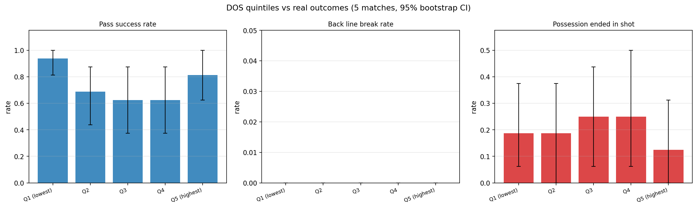

# DOS empirical validation report

_Generated by `test/validate_dos_outcomes.py` in 34s._

## Setup

- Matches analysed: **1**
- Events evaluated: **80** (passes=59, carries=18)
- DOS source: `dos_for_event` on the **real** event direction (vision smoothing=1.0, default PPCF params).
- Outcomes (NOT used as model inputs): `evaluation`, `back_line_break`, `bypassed_defenders`, `parent_possession.sum_xg_ind`.
- Critical: the model has **no access to xG, xT, success labels, or any value model**. Inputs are pure geometry + vision + skeleton orientation.

## DOS distribution

```
count    80.000000
mean      0.010768
std       0.010782
min      -0.013095
25%       0.003402
50%       0.007720
75%       0.016954
max       0.053158
```

- DOS > 0: **93.8%** of events
- DOS > 0.01: **43.8%**
- DOS > 0.05: **1.2%**

## H1 — Mann-Whitney U with effect size

One-sided alternative: events with positive outcome have **higher** DOS than the rest. `rbc` = rank-biserial correlation (effect size; +1 = perfect, 0 = no effect, −1 = inverse). `p_bonf` = Bonferroni-corrected p across the H1 family.

| Outcome | n+ | n− | median DOS (+) | median DOS (−) | mean DOS (+) | mean DOS (−) | rbc | U | p | p (bonf) |
|---|---:|---:|---:|---:|---:|---:|---:|---:|---:|---:|
| led_to_chance (xg>0) — ALL | 16 | 64 | 0.0090 | 0.0076 | 0.0104 | 0.0108 | -0.045 | 489 | 0.6113 | 1.0000 |
| back_line_break — ALL | 0 | 80 | nan | nan | nan | nan | +nan | nan | n/a | n/a |
| successfully_completed (passes) | 56 | 3 | nan | nan | nan | nan | +nan | nan | n/a | n/a |
| through_ball — ALL | 0 | 80 | nan | nan | nan | nan | +nan | nan | n/a | n/a |
| led_to_chance — passs only | 14 | 45 | 0.0090 | 0.0072 | 0.0110 | 0.0103 | +0.041 | 328 | 0.4119 | 0.8238 |

## H2 — Logistic regression (passes only)

`outcome ~ dos + distance + pressure + n_def_lane + n_def_goal`. The DOS coefficient should remain significant after controlling for the obvious confounders.

### Target: `back_line_break`

_Fit skipped (n=58)._

### Target: `success`

- N = 58
- Pseudo R² = 0.3825
- LLR p = 0.1078

| coef | value | p-value |
|---|---:|---:|
| const | +2.7705 | 0.7146 |
| dos | -42.8918 | 0.3584 |
| distance | +0.2040 | 0.3106 |
| pressure_player | -4.5270 | 0.1029 |
| n_def_lane | -0.1033 | 0.8906 |
| n_def_goal | +0.1037 | 0.8713 |

### Target: `chance`

- N = 58
- Pseudo R² = 0.0541
- LLR p = 0.6286

| coef | value | p-value |
|---|---:|---:|
| const | -0.7075 | 0.8108 |
| dos | +15.6101 | 0.6247 |
| distance | +0.0260 | 0.5374 |
| pressure_player | +0.4932 | 0.7247 |
| n_def_lane | -0.6460 | 0.2046 |
| n_def_goal | -0.0436 | 0.8638 |

## H3 — DOS quintiles vs outcomes

If the model captures real signal, success and chance rates should grow monotonically across DOS quintiles (95% bootstrap CIs).

```
               n  dos_mean  success_rate      success_ci  line_break_rate   line_break_ci  chance_rate       chance_ci   xg_mean
dos_q                                                                                                                           
Q1 (lowest)   16 -0.001191        0.9375  [0.812, 1.000]              0.0  [0.000, 0.000]       0.1875  [0.062, 0.375]  0.027325
Q2            16  0.004335        0.6875  [0.438, 0.875]              0.0  [0.000, 0.000]       0.1875  [0.000, 0.375]  0.011850
Q3            16  0.008241        0.6250  [0.375, 0.875]              0.0  [0.000, 0.000]       0.2500  [0.062, 0.438]  0.029244
Q4            16  0.015375        0.6250  [0.375, 0.875]              0.0  [0.000, 0.000]       0.2500  [0.062, 0.500]  0.014175
Q5 (highest)  16  0.027078        0.8125  [0.625, 1.000]              0.0  [0.000, 0.000]       0.1250  [0.000, 0.312]  0.015844
```



## H4 — Direction class breakdown

Direction class assigned by `dos_for_event` from the real event vector vs forward axis. This is the most direct test of Spielverlagerung's diagonality thesis: forward and diagonal classes should differ in line breaks and chance creation.

```
                  n  dos_mean  success_rate  line_break_rate  chance_rate  awareness_mean   xg_mean
direction_class                                                                                    
forward           6  0.014370      0.500000              0.0     0.166667        0.451429  0.015650
diagonal         28  0.010730      0.607143              0.0     0.214286        0.423563  0.028986
sideways         46  0.010321      0.847826              0.0     0.195652        0.440521  0.014554
```

## H5 — Zone breakdown (Spielverlagerung half-spaces)

Half-space defined as |y| in (0.18, 0.55) of the half pitch width — the lateral strip between the central column (|y|<0.18) and the wing (|y|>0.55).

**Origin zone** (where the ball is when the event starts):

```
             n  dos_mean  dos_pos_rate  line_break_rate  chance_rate  awareness_mean
zone                                                                                
center      18  0.008575      0.944444              0.0     0.333333        0.411336
half_space  27  0.013005      0.925926              0.0     0.037037        0.454836
wing        35  0.010169      0.942857              0.0     0.257143        0.432791
```

**Destination zone** (where the ball is delivered):

```
             n  dos_mean  dos_pos_rate  line_break_rate  chance_rate  awareness_mean
zone                                                                                
center      16  0.009534      0.937500              0.0     0.250000        0.390168
half_space  26  0.016220      0.923077              0.0     0.192308        0.471479
wing        38  0.007557      0.947368              0.0     0.184211        0.429767
```

## Per-event-type breakdown (passes / carries / take-ons)

Take-ons (1v1 duels won by the attacker keeping the ball) are SV's purest 'diagonal moment' — Hamilton's regate, the shoulder-drop. Single-frame DOS using the attacker's instantaneous skeleton velocity at the duel frame.

```
             n  dos_mean  dos_median  dos_pos_rate  success_rate  line_break_rate  chance_rate  awareness_mean  diag_share  fwd_share
event_type                                                                                                                           
carry       18  0.011515    0.008228      1.000000      0.000000              0.0     0.000000        0.478236    0.500000   0.166667
pass        59  0.010492    0.007487      0.932203      0.949153              0.0     0.237288        0.421867    0.288136   0.050847
takeon       3  0.011704    0.014694      0.666667      1.000000              0.0     0.666667        0.444633    0.666667   0.000000
```

## Per-match consistency

If DOS captures a real causal mechanism, the pattern should hold across **every** match — not just on average.

```
                 n  dos_mean  dos_pos_rate  line_break_rate  chance_rate  diag_share  fwd_share
match                                                                                          
Bayern_Hamburg  80  0.010768        0.9375              0.0          0.2        0.35      0.075
```

## Awareness layer

`awareness_mean` is the mean defender awareness toward the real event direction. Lower awareness = defenders blinder = bigger DOS gain.

- Pearson(awareness, dos) = **+0.138**
- Mean awareness on back-line-break events: nan
- Mean awareness on the rest: 0.435
