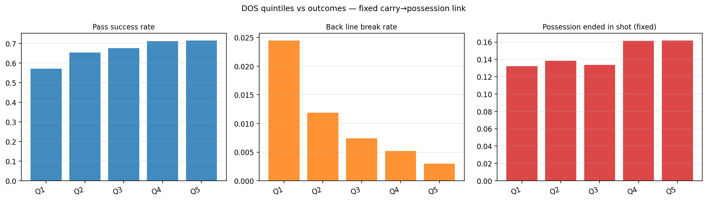

# DOS empirical validation — FIXED carry↔possession link

_Recomputed from `dos_validation_raw.csv` after fixing the DFL carry/possession linkage via frame-range containment. No DOS values were recomputed; only `parent_possession_xg` was corrected for carry rows (the XML omits carries from `TeamPossession > PossessionEvent`, so the naive id join returned 0.0 for every carry)._

- Events evaluated: **6,732** (passes=5128, carries=1604)
- Events with `parent_possession_xg > 0` after fix: **979** (was 718 before; carries now properly linked).

## Mann-Whitney U (fixed)

| Outcome | n+ | n− | mean (+) | mean (−) | median (+) | median (−) | rbc | p |
|---|---:|---:|---:|---:|---:|---:|---:|---:|
| led_to_chance (xg>0) — ALL events | 979 | 5753 | 0.0119 | 0.0107 | 0.0089 | 0.0075 | +0.055 | 2.76e-03 |
| back_line_break — ALL events | 70 | 6662 | 0.0041 | 0.0109 | 0.0006 | 0.0077 | -0.389 | 1.00e+00 |
| led_to_chance — passes only | 718 | 6014 | 0.0132 | 0.0106 | 0.0112 | 0.0073 | +0.126 | 1.51e-08 |
| passes only — led_to_chance | 718 | 4410 | 0.0132 | 0.0113 | 0.0112 | 0.0083 | +nan | 1.14e-04 |
| carries only — led_to_chance | 261 | 1343 | 0.0085 | 0.0087 | 0.0046 | 0.0048 | +nan | 4.78e-01 |

## Correlation DOS ↔ parent xG (continuous)

- Pearson  r = **+0.0180**, p = 1.39e-01
- Spearman ρ = **+0.0348**, p = 4.34e-03
- N = 6728

## Quintiles (fixed)

```
          n  dos_mean  success_rate  line_break_rate  chance_rate   xg_mean
dos_q                                                                      
Q1     1347 -0.001871      0.571641         0.024499     0.132146  0.012969
Q2     1346  0.002290      0.653789         0.011887     0.138187  0.017285
Q3     1346  0.007737      0.676820         0.007429     0.133730  0.011370
Q4     1346  0.015353      0.711738         0.005201     0.161218  0.015661
Q5     1347  0.030839      0.715664         0.002970     0.161841  0.017931
```



## Direction class (fixed)

```
                    n  dos_mean  success_rate  line_break_rate  chance_rate  awareness_mean
direction_class                                                                            
forward          1144  0.010386      0.400350         0.031469     0.143357        0.389990
diagonal         2165  0.010966      0.629561         0.015242     0.157968        0.410619
sideways         3423  0.010973      0.777680         0.000292     0.138183        0.460589
```

## Logistic regression (passes only, fixed xG for parent)

### Target: `back_line_break`
- n = 4761, Pseudo R² = 0.1566, LLR p = 1.31e-21

| coef | value | p |
|---|---:|---:|
| const | -2.9436 | 2.62e-06 |
| dos | -55.1417 | 6.08e-04 |
| distance | +0.0598 | 1.56e-09 |
| pressure_player | +0.1191 | 7.97e-01 |
| n_def_lane | +0.2291 | 2.80e-02 |
| n_def_goal | -0.2926 | 9.31e-07 |

### Target: `chance`
- n = 4761, Pseudo R² = 0.0116, LLR p = 9.74e-09

| coef | value | p |
|---|---:|---:|
| const | -1.1295 | 8.65e-06 |
| dos | +7.8611 | 2.06e-02 |
| distance | -0.0010 | 8.24e-01 |
| pressure_player | +0.2153 | 1.44e-01 |
| n_def_lane | +0.0384 | 3.27e-01 |
| n_def_goal | -0.0921 | 6.10e-05 |
